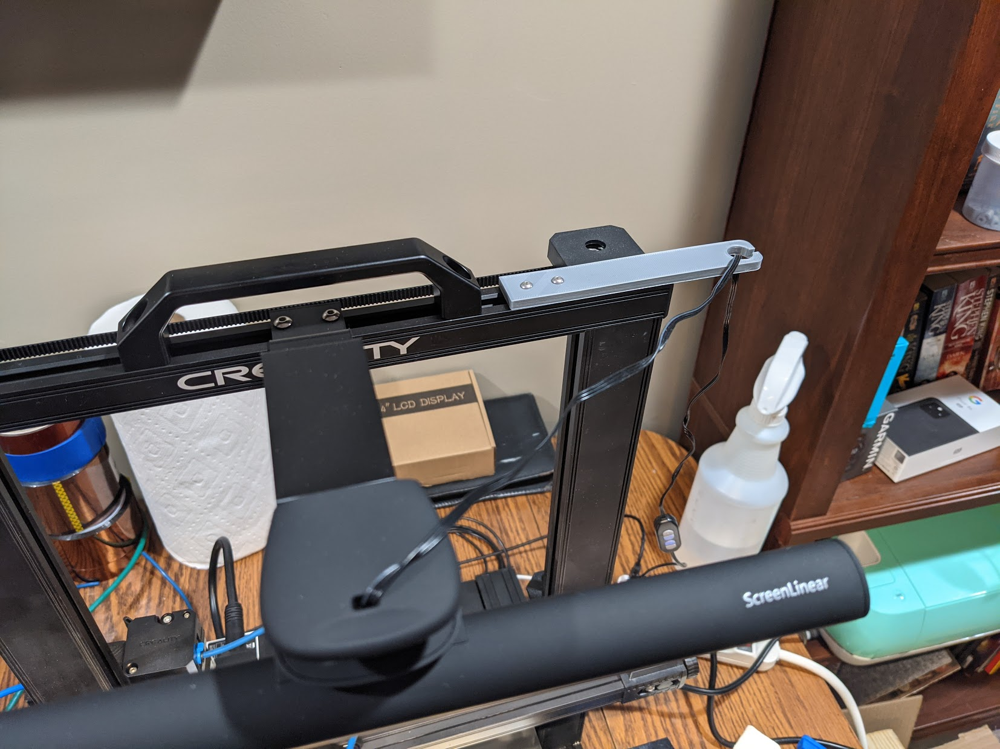

# CR6 Light Cable Mount

Stupid simple mount to hold cable for light.  Held into CR6 top gantry with M3 screws and Slot T-nuts

# Changelog

2021/01/24 - Add photos

## TO DO

1) Add a small extrustion to lift over screws since gantry screws are over flush, bends plastic a bit

## Design

Autocad Fusion 360 

## Slicer

Ultimaker Cura 4.8.0
- Printer: Creality CR6 SE
- Layer Height: 0.2mm
- Infill Density: 20%
- Infill Pattern: Grid
- Filament: Inland PLA+ 1.75mm Silver
- Material: PLA+
- Print Temperature: 215 degrees C

# Preview

